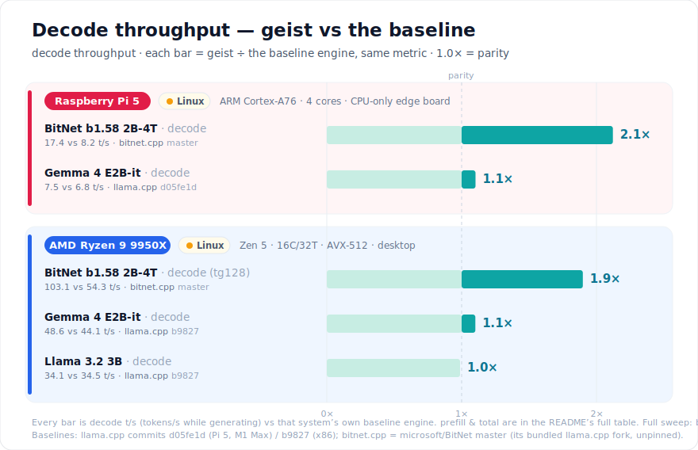

<p align="center">
  
</p>

# geist 👻

> **A tiny, local AI runtime for controlled edge agents.** Run useful models on
> the CPU you already own — especially a Raspberry Pi — and give them a small,
> explicit set of actions without handing your home or your data to a cloud.
>
> **Where this is going:** a small, application-neutral inference engine for
> controlled local agents. Applications provide request-scoped capabilities;
> Geist keeps the model warm, validates calls, and never invents permissions.

<p align="center">
  <strong>local by default</strong> &nbsp;·&nbsp;
  <strong>CPU-only</strong> &nbsp;·&nbsp;
  <strong>one small runtime</strong> &nbsp;·&nbsp;
  <strong>whitelist-gated actions</strong>
</p>

> **We want AI to belong to everyone.** Not rented from a data center, but running on
> the hardware you already have — your laptop, a Raspberry Pi, an old CPU with no GPU
> in sight. geist squeezes the most out of today's models to make that real: capable
> LLMs running **entirely on the CPU — private, offline, dependency-free**, with
> nothing to install.
>
> It began as one developer's attempt to actually *understand* how these models work
> — by building the engine from scratch, kernel by kernel. It's still that: an
> experiment, and an open invitation to join in.
>
> The proof so far is `geist-bitnet`: **one binary with Microsoft's ternary BitNet
> 2B-4T baked in** — [**download it**](#run-it-now--model-baked-in) and run it right
> away. Copy it to a Pi and it generates text, **drives tools**, and searches the web
> — all locally, and it decodes **~2× faster than Microsoft's own bitnet.cpp**. That
> same Pi now runs the first **[geist appliance](#from-engine-to-appliance--first-up-your-house-on-voice)**:
> a voice-controlled smart home — ~2 s per command, no cloud. Need more? The same
> engine runs **Gemma 4 with vision + audio** from one model file.

## The niche: useful local agents on constrained hardware

geist is not trying to be a universal model catalog or a drop-in replacement for
every GPU inference server. It is deliberately optimized for a narrower job:

- **Edge appliances:** one auditable C runtime, no Python environment and no
  container required.
- **Raspberry Pi and CPU-only hosts:** platform-specific kernels and ternary
  BitNet support where memory bandwidth matters most.
- **Controlled agents:** the host supplies a static or per-request immutable
  tool whitelist plus a step budget; the model cannot grant itself capabilities.
- **Adapter-owned policy:** applications retain authorization and execution;
  Geist receives only the capabilities offered for the current request.

### Home Assistant adapter

Home Assistant integration, policy, packaging, tests, and its implementation
roadmap live in the separate
[`geisten/geist-home-assistant`](https://github.com/geisten/geist-home-assistant)
repository. It consumes the same public `dynamic-tools-v1` contract as any
other adapter; Geist contains no Home Assistant credentials or product logic.

<p align="center">
  <strong>~2 s</strong> voice command → action <sub>(smart home, Pi 5, offline)</sub> &nbsp;·&nbsp;
  <strong>2.1×</strong> BitNet decode vs bitnet.cpp <sub>(Pi 5)</sub> &nbsp;·&nbsp;
  <strong>1.5×</strong> prefill vs llama.cpp <sub>(M1 Max)</sub> &nbsp;·&nbsp;
  <strong>1.9×</strong> BitNet decode vs bitnet.cpp <sub>(x86)</sub> &nbsp;·&nbsp;
  <strong>&lt; 1 MB</strong> binary, zero deps
  <br>
  <sub><a href="#faster-where-it-counts">↓ full scoreboard — decode t/s on every system, one metric</a></sub>
</p>

[](https://github.com/geisten/geisten/actions/workflows/ci.yml)
[](LICENSE)
[](https://en.wikipedia.org/wiki/C23_(C_standard_revision))
[-lightgrey.svg)](#getting-started)
[-yellow.svg)](#status)
[](https://github.com/geisten/geisten/discussions)
[](https://github.com/geisten/geisten/issues?q=is%3Aissue+is%3Aopen+label%3A%22good+first+issue%22)

**Questions, ideas, or stuck?** → [GitHub Discussions](https://github.com/geisten/geisten/discussions) · **Found a bug?** → [open an issue](https://github.com/geisten/geisten/issues/new) · **Want to build?** → [good first issues](https://github.com/geisten/geisten/issues?q=is%3Aissue+is%3Aopen+label%3A%22good+first+issue%22)

<p align="center">
  
</p>

*One self-contained `geist-bitnet` (BitNet b1.58 2B-4T baked in, **no model file**)
doing three things back-to-back: generate, then **drive tools** — list a folder,
search the web live. Same binary runs real-time on a
[Raspberry Pi 5](#faster-where-it-counts).*

---

## Run it now — model baked in

Download one file, run it — **no model file, no model argument**. The model lives
inside the binary.

| Platform | Single-file download (model included) |
| :-- | :-- |
| **Raspberry Pi / Linux** · ARM64 | [⬇ geist-bitnet-linux-arm64.tar.gz](https://github.com/geisten/geisten/releases/latest/download/geist-bitnet-linux-arm64.tar.gz) |
| **macOS** · Apple Silicon | [⬇ geist-bitnet-macos-arm64.tar.gz](https://github.com/geisten/geisten/releases/latest/download/geist-bitnet-macos-arm64.tar.gz) |
| **Linux** · x86-64 (AVX-512) | [⬇ geist-bitnet-linux-x86_64.tar.gz](https://github.com/geisten/geisten/releases/latest/download/geist-bitnet-linux-x86_64.tar.gz) |

```bash
./geist-bitnet "What is the capital of France?" # ask — instruct chat, clean answer
./geist-bitnet --raw "The capital of France is" # raw base-model completion
./geist-bitnet agent "Summarize report.md"     # one-shot tool-use agent
./geist-bitnet chat                            # multi-turn chat + memory
```

---

## Run it now — your own model

Two downloads: the **engine** (pick your platform) and a **model** (one GGUF runs
on every platform). Then point the engine at the model.

**Step 1 — the engine** (< 1 MB, model-less). Homebrew (macOS & Linux):

```bash
brew install geisten/tap/geist
```

— or grab the tarball directly:

| Platform | Engine download |
| :-- | :-- |
| **macOS** · Apple Silicon | [⬇ geist-macos-arm64.tar.gz](https://github.com/geisten/geisten/releases/latest/download/geist-macos-arm64.tar.gz) |
| **Raspberry Pi / Linux** · ARM64 | [⬇ geist-linux-arm64.tar.gz](https://github.com/geisten/geisten/releases/latest/download/geist-linux-arm64.tar.gz) |
| **Linux** · x86-64 (AVX-512) | [⬇ geist-linux-x86_64.tar.gz](https://github.com/geisten/geisten/releases/latest/download/geist-linux-x86_64.tar.gz) |

**Step 2 — a model** (one file, any platform):

| Model | Size | Direct download |
| :-- | --: | :-- |
| **Gemma 4 E2B-it** · `Q4_K_M` — text · vision · audio | 2.9 GB | [⬇ gguf](https://huggingface.co/unsloth/gemma-4-E2B-it-GGUF/resolve/main/gemma-4-E2B-it-Q4_K_M.gguf) |
| **Gemma 4 E4B-it** · `Q4_K_M` — bigger, text · vision · audio | 4.6 GB | [⬇ gguf](https://huggingface.co/unsloth/gemma-4-E4B-it-GGUF/resolve/main/gemma-4-E4B-it-Q4_K_M.gguf) |
| **BitNet b1.58 2B-4T** · `i2_s` — ternary, beats bitnet.cpp (Pi 5 & x86) | 1.1 GB | [⬇ gguf](https://huggingface.co/microsoft/bitnet-b1.58-2B-4T-gguf/resolve/main/ggml-model-i2_s.gguf) |

**Step 3 — run** (the model path is the only difference from the baked-in binary):

```bash
./geist -m model.gguf "What is the capital of France?"  # ask — instruct chat
./geist -m model.gguf --serve /tmp/geist.sock           # resident dynamic-tools daemon
```

<sub>Prebuilt for macOS · ARM64, Linux · ARM64 and Linux · x86-64 (AVX-512, runs on any x86-64-v3 CPU). Windows is still pending. BitNet is a **base model with no tool training** — geist forces a valid tool call from outside the sampler, so it routes and calls anyway.</sub>

---

## Build your adapter

The host-neutral contract is concentrated in
[`tools/dynamic_tools_v1.h`](tools/dynamic_tools_v1.h),
[`tools/dynamic_request_v1.h`](tools/dynamic_request_v1.h), and
[`tools/dynamic_host_v1.h`](tools/dynamic_host_v1.h); start yours there.

---

## …and the other half: the LLM, on the Pi itself

Voice assistants split in two. **Deterministic phrase-matching** handles device
control — fast, no model, no hallucination. An **LLM handles the rest**: the
general questions, the light reasoning, "how many minutes are in a day". That
second half usually gets **offloaded to a bigger box or the cloud**, because a
capable general model barely fits a 4 GB Pi.

geist runs it **on the Pi itself**. BitNet is ternary, so the whole model is
**1.2 GB** — about a third the footprint of a typical general model served via
Ollama (3.4 GB, which strains a 4 GB Pi and, without `use_mmap`, gets OOM-killed
on load). One binary, no Python, no Docker, no second machine:

```bash
./geist-bitnet "How many minutes are in a day?"   # -> A full day has 1440 minutes.
```

Warm, that answers in **~2 s on a Raspberry Pi 5** — `-c` wraps your prompt in the
model's chat template and stops cleanly, no tool loop, nothing leaving the LAN. So
the whole assistant — control *and* conversation — stays on the box you already own.
<sub>Measured on a Pi 5 (4 GB) over 10 general questions, warm, 4 threads; the same
turn on an M1 Max is well under a second. Method mirrors
[`benchmark/BENCHMARK_PI5.md`](benchmark/BENCHMARK_PI5.md).</sub>

---

## Why geist?

Four design choices that make *a file you own* real:

### One binary, zero dependencies
Static musl on Linux ARM (< 1 MB), Apple frameworks only on macOS. Fold the model
in too (`make EMBED_MODEL=…`) and deployment is *literally one file*.

### Faster where it counts
Same GGUF, greedy decode. geist leads **end-to-end throughput** on a Pi 5,
**prefill** on Apple's matrix unit, **matches-to-beats [llama.cpp](https://github.com/ggml-org/llama.cpp) on AMD x86**
(AVX-512), and **beats Microsoft's bitnet.cpp on ternary BitNet on both Pi 5 and
x86** (9950X: prefill +30 %, decode +38 %) — across edge and desktop:

<p align="center">
  
</p>

*One metric on every bar: **decode t/s** (tokens/s while generating) — geist ÷ its
own baseline engine, so the bars are directly comparable. Decode is the number you
feel in a chat. **prefill and total** for every system (incl. the M1 Max prefill
win and the Pi long-prompt total) are in the [full numbers table](#documentation)
below; sub-parity rows (Llama 3.2 on x86) are shown here too — nothing cherry-picked.*

**Run it on your own hardware** — same measurement, your machine:

```bash
make && make fetch-model                    # build ./geist + pull the Gemma GGUF
OMP_WAIT_POLICY=active make bench-small      # records decode t/s to benchmark/BENCHMARK.md
```

<sub>Cross-engine comparison vs a pinned llama.cpp, quality (MMLU) and full
methodology: [`benchmark/BENCHMARKING.md`](benchmark/BENCHMARKING.md).</sub>

<p align="center">
  
</p>

*Real-time on a **Raspberry Pi 5** — ternary BitNet b1.58 2B-4T (`i2_s`), no GPU,
no driver stack.*

### Ternary (1.58-bit) as a first-class citizen
geist runs Microsoft's BitNet b1.58 (`TQ2_0` and canonical `I2_S`) with integer-only
dot products — ARM **SDOT** (add/subtract, no multiplies) and x86 **AVX-512 VNNI**.
It beats Microsoft's own bitnet.cpp on **both**: a Pi 5 decodes **~2×** (17.4 vs
8.2 t/s), and an AMD 9950X does prefill **+61 %** (1098 vs 679.9) and decode
**+90 %** (103.1 vs 54.3 t/s) — 1.6-bpw base-3 decode packing included (#104).

### On-device tool-use interface for small models
A bounded, whitelist-gated tool loop plus routing and forced calls let a 2 B
model reliably *drive tools* — the hard part on an un-tool-trained model
(structure and value are forced from outside the sampler; only the routing
decision is the model's). geist ships this as a **header-only interface** in the
SDK (`agent.h`, `agent_main.h`, the `dynamic-tools-v1` protocol) and a resident
`--serve` daemon; the **concrete tools live in consumer projects** that link
libgeist:

| project | what it adds |
| :-- | :-- |
| [geistwissen](https://github.com/geisten/geistwissen) | knowledge tools — local doc search (RAG, no embeddings), a memory palace, file summarize, opt-in web |
| [geist-home-assistant](https://github.com/geisten/geist-home-assistant) | Home Assistant device control over `dynamic-tools-v1` |

Run the daemon and let a host supply the toolset per request over a chmod-600
Unix socket:

```bash
./geist -m model.gguf --serve /tmp/geist.sock
```

Interface, routing, forced calls and the security model:
[docs/agent.md](docs/agent.md).

<details>
<summary><strong>Why C?</strong> (the substrate choice, in full)</summary>

Not because it is the fastest (a systems language like Rust ties on raw
performance) and certainly not because it is the safest (it is the opposite).
The core reason is **reach, not speed**:

> **C is the substrate with maximal reach and minimal assumptions — the universal
> ABI and the everywhere-available, transparent compiler that every platform and
> every embedding language already speaks. We knowingly pay for that reach with
> memory safety.**

This maps directly onto promise #1 — *one file, runs anywhere, embeds anywhere*:
the header **is** the ABI (any language FFIs in with no shim), every
architecture/OS/accelerator toolchain speaks C first, and the source maps almost
1:1 to the emitted instructions — which matters when you reason about NEON kernels
by the cycle. Performance is table-stakes here, shared with the alternatives; what
picks C is ubiquity + zero-ceremony interop + transparency.

The honest counter-position: **if memory safety outweighed ubiquity and
simplicity for you, Rust would be the better choice.** We deliberately weighed it
the other way, and offset the safety cost with strict warnings
(`-Werror -Wshadow -Wundef`), ASan/UBSan CI (`make MODE=asan`), bit-exact golden
tests, and a small auditable core (the stable text path is ~70 lines).

</details>

---

## Models that run today

Two models are first-class and one-download-and-go. Everything below runs on the
same `./geist` binary — pick by your hardware and what you need.

| Model | Modality | Quant | ~Size | RAM | Best on | Get it |
| :-- | :-- | :-- | --: | --: | :-- | :-- |
| **Gemma 4 E2B-it** | text · vision · audio | `Q4_K_M` | 2.9 GB | ≥ 4 GB | Mac / Pi 5 | `make fetch-model` · [⬇ gguf](https://huggingface.co/unsloth/gemma-4-E2B-it-GGUF/resolve/main/gemma-4-E2B-it-Q4_K_M.gguf) |
| Gemma 4 E4B-it | text · vision · audio | `Q4_K_M` | 4.6 GB | ≥ 6 GB | Mac | [⬇ gguf](https://huggingface.co/unsloth/gemma-4-E4B-it-GGUF/resolve/main/gemma-4-E4B-it-Q4_K_M.gguf) |
| **BitNet b1.58 2B-4T** | text (ternary) | `i2_s` | 1.1 GB | ≥ 4 GB | **Pi 5 · x86** | [⬇ gguf](https://huggingface.co/microsoft/bitnet-b1.58-2B-4T-gguf/resolve/main/ggml-model-i2_s.gguf) |
| BitNet b1.58-large | text (ternary) | `TQ2_0` | 207 MB | ≥ 1 GB | smallest footprint | convert from [1bitLLM ↗](https://huggingface.co/1bitLLM/bitnet_b1_58-large) |

```bash
# Gemma 4 E2B-it (text + vision + audio towers, all on one binary)
make fetch-model

# BitNet b1.58 2B-4T — the ~2× decode win on a Pi 5
curl -L -o bitnet-2b4t.i2_s.gguf \
  https://huggingface.co/microsoft/bitnet-b1.58-2B-4T-gguf/resolve/main/ggml-model-i2_s.gguf
```

> **Vision & audio** ride on the Gemma 4 model — the engine has SigLIP (vision) and
> a Conformer (audio) tower built in; see [`docs/ARCHITECTURE.md`](docs/ARCHITECTURE.md)
> for attaching image/audio inputs. **TQ2_0** has no canonical GGUF yet — convert
> the 1bitLLM base (see [`benchmark/TERNARY_BITNET.md`](benchmark/TERNARY_BITNET.md)).

---

## Getting Started

> **Just want to run it?** Prebuilt binaries (macOS · ARM64, Linux · ARM64,
> Linux · x86-64) are at the [top](#run-it-now--model-baked-in). This section builds from source —
> any platform with a C23 compiler, the path for a custom target or Windows.

### Prerequisites
- A C23 compiler: **gcc ≥ 14**, or Apple-clang ≥ 16 (Xcode 16 / macOS 15).
- `make`.
- **macOS:** Homebrew `libomp` recommended for multi-threading.

### 1. Build
`make` auto-detects your target and drops a `./geist` symlink in the repo root:

```bash
git clone https://github.com/geisten/geisten && cd geisten
make                       # or: make TARGET=mac-omp | pi5 | linux
```

### 2. Get a model
```bash
make fetch-model           # Gemma 4 E2B-it Q4_K_M (~3.1 GB) — optional helper
```

---

## Usage

### Embed the library (C)

The stable text path is ~15 lines: `geist_backend_create` → `geist_model_load` →
`geist_session_create` → loop `geist_session_decode_step`. The header **is** the ABI
— any language FFIs in with no shim. Runnable example: `make -C examples`; full
walkthrough in [`docs/QUICKSTART.md`](docs/QUICKSTART.md) and the API in
[`include/geist.h`](include/geist.h).

### Ship one file (model baked in)

**Prebuilt:** every [release](https://github.com/geisten/geisten/releases/latest)
ships a `geist-bitnet-<platform>.tar.gz` — BitNet 2B-4T already baked in, no model
file, no path argument. Download, extract, `./geist-bitnet "your prompt"` — or just
`curl … install.sh | sh` ([top](#run-it-now--model-baked-in)). That's the whole app.

**Build your own** with any GGUF. The plain `make` build gives you a `geist` that
**takes a model path** (you bring the GGUF); a separate **`make EMBED_MODEL=…`** build
*bakes the model in*, so that binary needs **no model argument**.

Give it its own name with `EMBED_NAME` so it's never confused with the
model-needing `geist`:

```bash
make EMBED_MODEL=bitnet-2b4t.i2_s.gguf EMBED_NAME=geist-bitnet   # GGUF baked in (zero-copy)
./geist-bitnet "What is the capital of France?"      # ask — no model path
./geist-bitnet agent "Summarize the file report.md"  # tools too — no model path
```

(Agent + chat work on the baked-in model. To ship it, just copy the binary —
`bin/<target>/release/tools/geist` — under whatever name you like.)

The weights are aliased zero-copy from the binary's read-only data (no extra RAM),
so this suits **small** models — the binary grows by the model size, and >~1.5 GB
exceeds the 2 GB GitHub-release limit. (Runs real-time on a Pi 5 —
[see above](#faster-where-it-counts).)

---

## Documentation

Repository ownership and the complete map are in
[`docs/README.md`](docs/README.md).

| Document | What it covers |
| :-- | :-- |
| [`docs/QUICKSTART.md`](docs/QUICKSTART.md) | Run the CLI and embed the library in two minutes. |
| [`docs/ARCHITECTURE.md`](docs/ARCHITECTURE.md) | The three layers, load-time kernel binding, the pipeline. |
| [`docs/agent.md`](docs/agent.md) | Tool-use agents, bundled tools, dynamic adapters, routing, forced calls, and the security model. |
| [`docs/DEPLOY.md`](docs/DEPLOY.md) | Single-binary builds, server/embedded deployment. |
| [`benchmark/`](benchmark/README.md) | Methodology & full results ([Apple/Pi 5](benchmark/BENCHMARK.md), [ternary BitNet](benchmark/TERNARY_BITNET.md)). |
| [`include/geist.h`](include/geist.h) | The public C API, with `STABLE` / `EXPERIMENTAL` stability tags. |

<details>
<summary><strong>Full benchmark numbers</strong> — exact t/s per system (the <a href="#faster-where-it-counts">scoreboard</a> above, as a table)</summary>

| model | platform | metric | **geist** | baseline |
| :-- | :-- | :-- | --: | --: |
| Gemma 4 E2B-it (Q4_K_M) | **Pi 5** | total t/s (32p+128d) | **8.8** | 8.2 *(llama.cpp)* |
| Gemma 4 E2B-it (Q4_K_M) | **Pi 5** | decode t/s | **7.5** | 6.8 *(llama.cpp)* |
| Gemma 4 E2B-it (Q4_K_M) | **M1 Max** | prefill t/s (pp1024) | **144** | 97 *(llama.cpp)* |
| BitNet b1.58 2B-4T (`i2_s`) | **Pi 5** | decode t/s | **17.4** | 8.2 *(bitnet.cpp)* |
| BitNet b1.58 2B-4T (`i2_s`) | **AMD 9950X** | prefill t/s (pp128) | **1098** | 679.9 *(bitnet.cpp)* |
| BitNet b1.58 2B-4T (`i2_s`) | **AMD 9950X** | decode t/s (tg128) | **103.1** | 54.3 *(bitnet.cpp)* |
| Gemma 4 E2B-it (Q4_K_M) | **AMD 9950X** | prefill t/s | **512** | 495 *(llama.cpp)* |
| Gemma 4 E2B-it (Q4_K_M) | **AMD 9950X** | decode t/s | **48.6** | 44.1 *(llama.cpp)* |
| Llama 3.2 3B (Q4_K_M) | **AMD 9950X** | prefill t/s | **351** | 346 *(llama.cpp)* |
| Llama 3.2 3B (Q4_K_M) | **AMD 9950X** | decode t/s | 34.1 | 34.5 *(llama.cpp)* |
| Gemma 4 E2B-it (Q4_K_M) | **M1 Max GPU** *(Metal, experimental)* | prefill t/s (pp512) | 987 | 1542 *(llama.cpp Metal)* |
| Gemma 4 E2B-it (Q4_K_M) | **M1 Max GPU** *(Metal, experimental)* | decode t/s (tg64) | 81.2 | 91.3 *(llama.cpp Metal)* |

<sub>**Baseline versions:** llama.cpp `d05fe1d` (Pi 5, M1 Max) · `b9827` (x86) — bitnet.cpp = [microsoft/BitNet](https://github.com/microsoft/BitNet) `master` (its bundled llama.cpp fork, unpinned `--depth 1` clone). Full methodology: [`benchmark/`](benchmark/README.md).</sub>

<sub>**Metal backend status** (`BACKENDS="… metal"`): experimental — greedy-decode tokens verified identical to the `cpu_scalar` reference at every optimization step. Decode is within **12 %** of llama.cpp (81.2 vs 91.3 t/s) and holds up at long context (73 t/s at kv≈2100, vs 27 before the head_dim-512 flash kernels). All attention — including the head_dim-512 full-attention layers — runs simdgroup flash (8-simdgroup prefill variant + 16-chunk split-KV decode variant) on a native f16 KV cache (half the KV memory, zero per-call conversion), with fused per-layer blocks (q/k/v norm+RoPE+KV-append, gate+up GeGLU matvec, k/v pair, PLE), llama-style pipelined command buffers, and a device greedy argmax (4-byte token readback). The remaining prefill gap is the shared ~6-TF q4_K GEMM plateau plus flash-kernel efficiency — kernel-level work that needs M3+ profiler counters to attribute; the full measurement ledger lives in `docs/proposals/metal-beat-llamacpp-plan.md`. Long context works past the 4096 default: the session window grows with the workload (the CLI sizes it from prompt + decode budget) and over-capacity prefills are rejected up-front with `GEIST_E_TOO_MANY_TOKENS` instead of the old silent decode no-op — pp5235 greedy on Metal matches the CPU reference across the 4096 boundary. Cool-state protocol (240 s idle), geist and llama.cpp measured back-to-back (Homebrew llama.cpp, `BLAS,MTL`), M1 Max 32-core.</sub>
</details>

---

## Status

`geist` is **v0.4.0 — experimental**. It runs Gemma 4 (text + vision + audio) end
to end on the CPU backends and has a broad C test suite (`make test`). The
`STABLE` core (load → session → decode → tokenize) is the part to build on;
`EXPERIMENTAL`-tagged surfaces (KV-cache modes, speculative decode, multimodal
attach) may still change between minor versions.

---

## Where this is going

geist isn't trying to out-benchmark llama.cpp or replace anyone's toolchain. It
started as one developer's way of understanding how these models actually work — by
building the engine, kernel by kernel, from scratch. That spirit still drives it:
we'd rather open new doors than race down someone else's track.

The throughline is one belief — **small, heavily quantized models can do far more
than people assume, if the whole stack is built around them.** So that's what we're
building:

- **Squeeze the model, not the user** — quantize aggressively and run the most
  extreme quantizations (ternary and binary) as first-class citizens, not
  afterthoughts.
- **Research ternary / binary models** — [BitNet](benchmark/TERNARY_BITNET.md) is
  just the start; 1.58-bit is where the interesting math lives.
- **Optimized for what people actually own** — CPUs and small GPUs, all the way down
  to a Raspberry Pi 5.
- **One-step install** — engine plus model, nothing else to set up.
- **Agents built for small models** — a tight harness, fixed algorithms where they
  beat a forward pass, conversion to markdown, and more, so a 2 B model can match a
  much bigger one on a narrow, well-defined task.
- **A memory that fits a small model** — recall shaped for what these models can
  actually hold, not a bolt-on vector store.
- **Models that adapt** — dynamically specializing to a task, learning,
  self-organizing over time.

Most of this is barely started. That's the point — [come build it with
us](#contributing).

---

## Contributing

The interesting work is wide open — low-level kernels and quantization research,
not yet-another-wrapper. **From clone to green tests in 30 seconds:**

```bash
git clone https://github.com/geisten/geisten && cd geisten
make && make test          # builds ./geist, runs the full C suite
```

---

## Citation

Using geist in research? A "Cite this repository" button is on the repo sidebar
(from [`CITATION.cff`](CITATION.cff)), or use:

```bibtex
@software{schlegel_geist_2026,
  author  = {Schlegel, Germar},
  title   = {geist: a dependency-free CPU inference engine and on-device agent for small LLMs},
  year    = {2026},
  version = {0.4.0},
  url     = {https://github.com/geisten/geisten}
}
```

---

## License

Licensed under the **Apache License 2.0** — permissive, with an explicit patent
grant. See [LICENSE](LICENSE) and [NOTICE](NOTICE).

---

📄 [Impressum](https://geisten.net/impressum.html) · © 2026 geisten Holding UG (haftungsbeschränkt)

*"The future of AI is local, private, and embedded."* 👻
