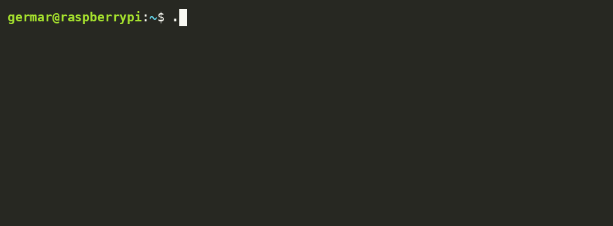
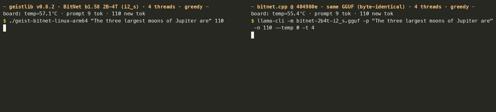
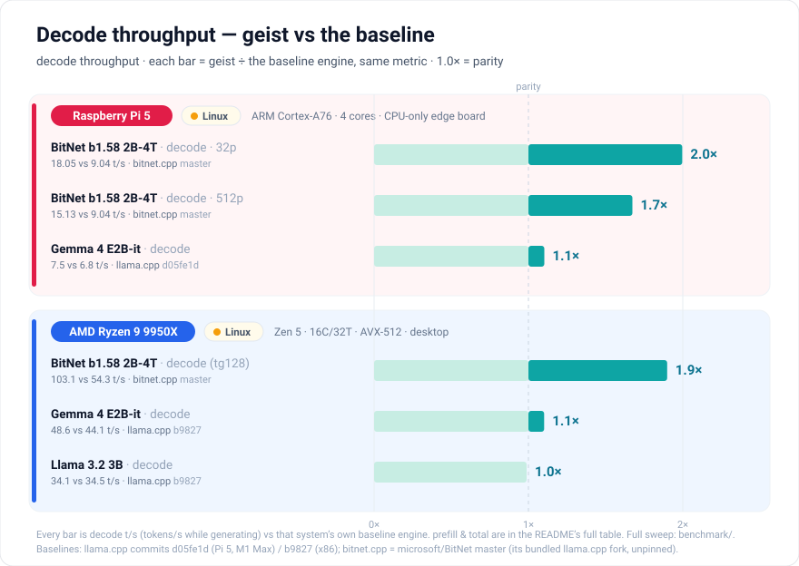

<p align="center">
  
</p>

# geistlib 👻

> **Run Microsoft BitNet 2B locally on a 4 GB Raspberry Pi 5.**
> One binary. No Python, no model setup, no cloud.

```bash
curl -L -o geist-bitnet https://github.com/geisten/geistlib/releases/latest/download/geist-bitnet-linux-arm64
chmod +x geist-bitnet
./geist-bitnet "The capital of France is"
```

Run it with no arguments for a minimal REPL (each line completes
independently; the model stays loaded). Full guide — cooling, cold-start
times, errors, model limits: [`docs/PI5_BITNET.md`](docs/PI5_BITNET.md).

<p align="center">
  
</p>

*Real-time on a Raspberry Pi 5 — ternary BitNet b1.58 2B-4T generating text from
a single dependency-free binary. No GPU, no driver stack.*

- **Tested on a 4 GB Pi 5.** The [reference runs](benchmark/reference_runs.json)
  come from a Raspberry Pi 5 Model B with 4 GB RAM — not an 8 GB board, not a
  cross-compile guess.
- **15–18 decode tokens/s**, depending on context — measured 17.9 t/s at a short
  prompt, 15.0 t/s at a 512-token prompt (frozen protocol, 10 repeats,
  [methodology](benchmark/README.md)).
- **~1.2 GB download**, model included. **Private and offline after download** —
  nothing ever leaves the device.

**Platform:** tested on Raspberry Pi 5 (4 GB), 64-bit Raspberry Pi OS. The
prebuilt one-file binaries ship for Linux arm64 **and** x86_64 (swap the
`-linux-arm64` suffix for `-linux-x86_64` above). Also runs on macOS —
[build from source](#build-from-source) there, or use the
[prebuilt SDK](#embed-the-library).

[](https://github.com/geisten/geistlib/actions/workflows/ci.yml)
[](LICENSE)
[](https://en.wikipedia.org/wiki/C23_(C_standard_revision))
[](#build-from-source)
[-yellow.svg)](#status)
[](https://github.com/geisten/geistlib/discussions)
[](https://github.com/geisten/geistlib/issues?q=is%3Aissue+is%3Aopen+label%3A%22good+first+issue%22)

**Questions, ideas, or stuck?** → [GitHub Discussions](https://github.com/geisten/geistlib/discussions) · **Found a bug?** → [open an issue](https://github.com/geisten/geistlib/issues/new) · **Want to build?** → [good first issues](https://github.com/geisten/geistlib/issues?q=is%3Aissue+is%3Aopen+label%3A%22good+first+issue%22)

---

## How it works

geistlib is **one C23 inference engine** — no Python, no runtime, no container,
a small static binary with zero dependencies (the engine itself is <1 MB; the slim CLI ships at ~2 MB). Two properties carry the
Pi 5 result:

- **Ternary kernels, first-class.** BitNet b1.58 weighs every parameter as
  −1/0/+1, and geistlib runs it with integer-only dot products — ARM SDOT
  (add/subtract, no multiplies) on the Pi, AVX-512 VNNI on x86. The whole 2B
  model is 1.1 GiB, a third the footprint of a comparable 4-bit model — which is
  what makes a 4 GB board roomy instead of impossible.
- **Zero-copy weights.** The GGUF is mmapped (or, in `geist-bitnet`, aliased
  straight out of the binary's read-only data) and demand-paged — weights cost
  disk, not RAM, and loading is near-instant.

The deeper tour — three layers, load-time kernel binding, why C —
is in [`docs/ARCHITECTURE.md`](docs/ARCHITECTURE.md).

## An engine, not an application

geistlib loads models and produces tokens — and has **no opinion** about chat
templates, tool use, system prompts, or whether a model may act. That is the
deal: an engine that stays application-neutral is one *anyone* can embed — in
an agent, an appliance, a game, a pipeline — without inheriting someone else's
product decisions. Policy belongs to whatever links the engine;
[`docs/README.md`](docs/README.md) draws that boundary explicitly.

## Bring your own model

The slim CLI (release asset `geist-linux-arm64`, ~2 MB — the platform suffix
belongs to the download, not to your disk) runs any GGUF that carries its own
tokenizer:

```bash
curl -L -o geist https://github.com/geisten/geistlib/releases/latest/download/geist-linux-arm64
chmod +x geist
./geist model.gguf "your prompt" [max_new_tokens]
```

Gemma 4 (text + vision + audio), Llama-family models, and the 207 MB
`TQ2_0` BitNet are covered in [`docs/MODELS.md`](docs/MODELS.md).

## Build from source

Three commands from clone to generated text, on macOS and Linux (arm64 +
x86-64). Prerequisites: **gcc ≥ 14** or Apple-clang ≥ 16, and `make`; on macOS,
Homebrew `libomp`.

```bash
git clone https://github.com/geisten/geistlib && cd geistlib
make lib                     # auto-detects target; or: make TARGET=mac-omp | pi5 | linux
make fetch-bench-model       # BitNet b1.58 2B-4T, ternary, ~1.2 GB
make run ARGS='gguf_artifacts/bitnet-2b4t-i2_s.gguf "The capital of France is"'
```

`make run` builds and runs [`examples/simple_generate.c`](examples/simple_generate.c)
— load, prefill, greedy-decode in ~15 lines against the STABLE core, and the
thing to copy when you embed the library.

## Embed the library

Every [release](https://github.com/geisten/geistlib/releases/latest) ships
`libgeist-<platform>.tar.gz` — `libgeist.a`, `include/*.h` and `LICENSE`, for
`macos-arm64`, `linux-arm64` and `linux-x86_64`. Verify against `SHA256SUMS`,
then link:

```bash
cc -std=c23 -I libgeist-linux-arm64/include my_app.c \
   libgeist-linux-arm64/libgeist.a -fopenmp -lm -o my_app
```

The stable text path is ~15 lines: `geist_backend_create` →
`geist_model_load` → `geist_session_create` → loop `geist_session_decode_step`.
The header **is** the ABI — any language FFIs in with no shim
([`examples/ffi/`](examples/ffi/) proves it: the complete integration in
Python, Rust, Go and JavaScript, ~30-40 lines each, no bindings package), and
the [engine-not-application](#an-engine-not-an-application) neutrality means
your app keeps every product decision. Walkthrough:
[`docs/QUICKSTART.md`](docs/QUICKSTART.md); API: [`include/geist.h`](include/geist.h)
(`STABLE`/`EXPERIMENTAL` tags); deployment, incl. folding a model into your own
binary: [`docs/DEPLOY.md`](docs/DEPLOY.md).

<sub>The static archive is an OpenMP build, so a consumer supplies the OpenMP
runtime: `-fopenmp` on Linux, `-framework Accelerate <libomp>/lib/libomp.a` on
macOS.</sub>

## How fast?

Same GGUF, greedy decode, both engines measured in the same run on the same
box, thermally gated. geistlib beats Microsoft's own bitnet.cpp on ternary
BitNet on both a Pi 5 (**~2×** decode) and an AMD 9950X, and matches-to-beats
llama.cpp on the CPU paths:

<p align="center">
  
</p>

*One board, one GGUF, recorded sequentially with a thermal gate and shown side
by side — [how this was made, and more demos](docs/DEMOS.md).*

<p align="center">
  
</p>

**Don't trust the numbers — run them.** `make bench` measures geistlib *and*
any `llama.cpp`/`bitnet.cpp` it finds on your box, against the byte-identical
GGUF, and prints the spread. Greedy output is bit-identical to the scalar
reference before any speedup is quoted. Frozen protocol, raw data and full
per-system tables: [`benchmark/`](benchmark/README.md). The experimental GPU
backends are catching up fast — Metal decodes the Qwen3.8-27B at 1.48×
llama.cpp Metal on an M1 Max: [`docs/BACKENDS.md`](docs/BACKENDS.md).

---

## Status

`geistlib` is **v0.10.3 — experimental**. The `STABLE` core (load → session →
decode → tokenize) is the part to build on; `EXPERIMENTAL`-tagged surfaces
(KV-cache modes, speculative decode, multimodal attach, GPU backends) may
change between minor versions. It runs Gemma 4 (text + vision + audio) end to
end on the CPU backends and has a broad C test suite (`make test`).

## Where this is going

geistlib started as one developer's way of understanding how these models
actually work — by building the engine, kernel by kernel, from scratch. The
throughline is one belief: **small, heavily quantized models can do far more
than people assume, if the whole stack is built around them.**

- **Squeeze the model, not the user** — ternary and binary quantization as
  first-class citizens, not afterthoughts.
- **Optimized for what people actually own** — CPUs and small GPUs, all the way
  down to a Raspberry Pi 5.
- **One-step install** — engine plus model, nothing else to set up.
- **Models that adapt** — dynamically specializing to a task, learning,
  self-organizing over time.

Most of this is barely started. That's the point — [come build it with
us](#contributing). Track by track: [`ROADMAP.md`](ROADMAP.md).

## Contributing

The interesting work is wide open — low-level kernels and quantization
research, not yet-another-wrapper. **From clone to green tests in one
command:**

```bash
make lib && make test      # builds libgeist.a, runs the full C suite
```

Where the leverage is right now:

- **NEON / AVX-512 microkernels** — the ternary and Q4_K paths, measured per cycle.
- **Low-bit quantization** — TQ2_0, IQ variants, and whatever is smaller than 1.58 bits.
- **Portability** — Windows, wider x86-64 quant coverage, the open Vulkan prefill front.

Ground rules, build modes and the review bar: [`CONTRIBUTING.md`](CONTRIBUTING.md).
Not sure where to start? Ask in
[Discussions](https://github.com/geisten/geistlib/discussions) — a half-formed
idea is a fine opening message.

## Documentation

The complete map is in [`docs/README.md`](docs/README.md).

| Document | What it covers |
| :-- | :-- |
| [`docs/QUICKSTART.md`](docs/QUICKSTART.md) | Embed the library in two minutes. |
| [`docs/PI5_BITNET.md`](docs/PI5_BITNET.md) | The Pi 5 BitNet binary — install, speed, errors, model limits. |
| [`docs/DEMOS.md`](docs/DEMOS.md) | Recorded demos — vs bitnet.cpp, offline box, writing assistant. |
| [`docs/MODELS.md`](docs/MODELS.md) | Supported models — Gemma (vision/audio), Llama, ternary BitNet. |
| [`docs/BACKENDS.md`](docs/BACKENDS.md) | CPU backends and the experimental Metal / Vulkan GPU paths. |
| [`docs/ARCHITECTURE.md`](docs/ARCHITECTURE.md) | The three layers, kernel binding, and why C. |
| [`docs/DEPLOY.md`](docs/DEPLOY.md) | Building, the packaged SDK, single-file deployment. |
| [`benchmark/`](benchmark/README.md) | Methodology, raw reference runs, per-system results. |

## Citation

Using geistlib in research? A "Cite this repository" button is on the repo
sidebar (from [`CITATION.cff`](CITATION.cff)), or use:

```bibtex
@software{schlegel_geistlib_2026,
  author  = {Schlegel, Germar},
  title   = {geistlib: a dependency-free inference engine for small LLMs},
  year    = {2026},
  version = {0.10.3},
  url     = {https://github.com/geisten/geistlib}
}
```

## License

Licensed under the **Apache License 2.0** — permissive, with an explicit patent
grant. See [LICENSE](LICENSE) and [NOTICE](NOTICE).
