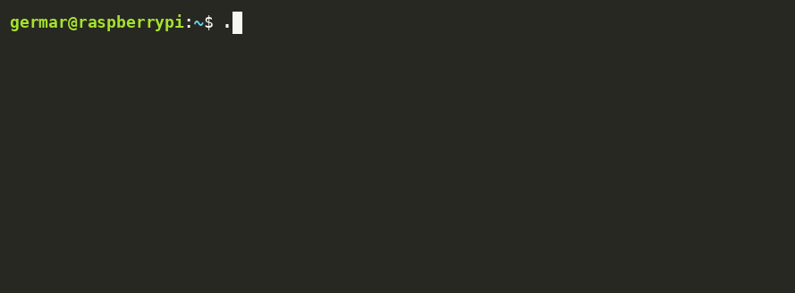
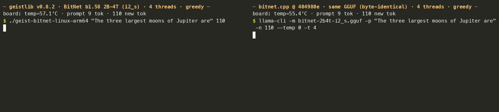
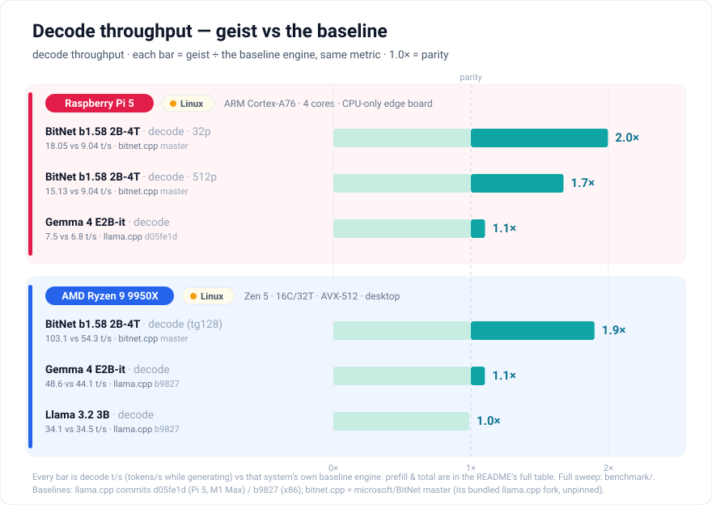

<p align="center">
  
</p>

# geistlib 👻

> **Run Microsoft BitNet 2B locally on a 4 GB Raspberry Pi 5.**
> One binary. No Python, no model setup, no cloud.

```bash
curl -L -o geist-bitnet https://github.com/geisten/geistlib/releases/latest/download/geist-bitnet-linux-arm64
chmod +x geist-bitnet
./geist-bitnet "The capital of France is"
```

Run it with no arguments for a minimal REPL (each line completes
independently; the model stays loaded). Cooling, cold-start times, errors and
model limits: [`docs/PI5_BITNET.md`](docs/PI5_BITNET.md).

<p align="center">
  
</p>

*Real time on a Raspberry Pi 5: ternary BitNet b1.58 2B-4T from a single
dependency-free binary. No GPU, no driver stack.*

- **Tested on a 4 GB Pi 5** (Raspberry Pi 5 Model B, 64-bit Raspberry Pi OS) —
  see the [reference runs](benchmark/reference_runs.json).
- **15–18 decode tokens/s** depending on context: 17.9 t/s at a short prompt,
  15.0 t/s at a 512-token prompt (frozen protocol, 10 repeats,
  [methodology](benchmark/README.md)).
- **~1.2 GB download**, model included. **Offline after download**: nothing
  leaves the device.

Prebuilt binaries ship for Linux arm64 and x86_64 (swap `-linux-arm64` for
`-linux-x86_64`). On macOS, [build from source](#build-from-source) or use the
[prebuilt SDK](#embed-the-library).

[](https://github.com/geisten/geistlib/actions/workflows/ci.yml)
[](LICENSE)
[](https://en.wikipedia.org/wiki/C23_(C_standard_revision))
[](#build-from-source)
[](https://github.com/geisten/geistlib/releases/latest)
[](#status)
[](https://github.com/geisten/geistlib/discussions)
[](https://github.com/geisten/geistlib/issues?q=is%3Aissue+is%3Aopen+label%3A%22good+first+issue%22)

**Questions?** → [Discussions](https://github.com/geisten/geistlib/discussions) · **Bug?** → [open an issue](https://github.com/geisten/geistlib/issues/new) · **Want to help?** → [good first issues](https://github.com/geisten/geistlib/issues?q=is%3Aissue+is%3Aopen+label%3A%22good+first+issue%22)

---

## What it is

geistlib is a **C23 inference engine** shipped as a static library
(`libgeist.a`) with no runtime dependencies. It loads GGUF models and produces
tokens.

- **Ternary kernels, first-class.** BitNet b1.58 stores every weight as
  −1/0/+1; geistlib runs it with integer-only dot products (ARM SDOT on the Pi,
  AVX-512 VNNI on x86). The 2B model is 1.1 GiB, about a third of a comparable
  4-bit model.
- **Zero-copy weights.** The GGUF is mmapped (or, in `geist-bitnet`, aliased
  out of the binary's read-only data) and demand-paged. Some CPU kernels keep
  a repacked copy of a dtype for speed;
  [`docs/BACKENDS.md`](docs/BACKENDS.md#resident-memory-per-backend) lists them
  and the switch for each.
- **An engine, not an application.** No chat templates, tool use or system
  prompts — those belong to whatever links the library. The boundary is in
  [`docs/README.md`](docs/README.md).

Architecture (layers, load-time kernel binding, why C):
[`docs/ARCHITECTURE.md`](docs/ARCHITECTURE.md).

## Bring your own model

The slim CLI (release asset `geist-linux-arm64` or `geist-linux-x86_64`,
~2 MB) runs any supported GGUF that carries its own tokenizer:

```bash
curl -L -o geist https://github.com/geisten/geistlib/releases/latest/download/geist-linux-arm64
chmod +x geist
./geist model.gguf "your prompt" [max_new_tokens]
```

Model families: Gemma 4 (text, vision, audio), Llama, Qwen3, Qwen3.5/3.6/3.8
dense hybrids (incl. Ternary-Bonsai-2-27B) and BitNet b1.58. Downloads, sizes
and RAM needs: [`docs/MODELS.md`](docs/MODELS.md).

## Build from source

macOS and Linux (arm64, x86-64). Needs **gcc ≥ 14** or Apple clang ≥ 16, and
`make`; on macOS also Homebrew `libomp` for multi-threading.

```bash
git clone https://github.com/geisten/geistlib && cd geistlib
make lib                     # auto-detects target; or TARGET=mac-omp | mac | pi5 | linux
make fetch-bench-model       # BitNet b1.58 2B-4T, ternary, ~1.2 GB
make run ARGS='gguf_artifacts/bitnet-2b4t-i2_s.gguf "The capital of France is"'
```

- Ubuntu 24.04 ships gcc 13: `apt install gcc-14` and pass `CC=gcc-14`.
- Linux links OpenBLAS by default (`libopenblas-dev`); `GEMM_PROVIDER=native`
  builds without it.
- `make help` lists every target and option.

`make run` builds and runs [`examples/simple_generate.c`](examples/simple_generate.c):
load, prefill, decode against the STABLE API only — the program to copy when
you embed the library.

## Embed the library

Every [release](https://github.com/geisten/geistlib/releases/latest) ships
`libgeist-<platform>.tar.gz` (`libgeist.a`, `include/*.h`, `LICENSE`) for
`macos-arm64`, `linux-arm64` and `linux-x86_64`. Verify it against
`SHA256SUMS` and its build provenance with
`gh attestation verify libgeist-linux-arm64.tar.gz --repo geisten/geistlib`,
then link:

```bash
cc -std=c23 -I libgeist-linux-arm64/include my_app.c \
   libgeist-linux-arm64/libgeist.a -fopenmp -lm -o my_app
# macOS: replace -fopenmp with -framework Accelerate "$(brew --prefix libomp)/lib/libomp.a"
```

The text path is `geist_backend_create` → `geist_model_load` →
`geist_session_create` → `geist_session_set_prompt` → loop
`geist_session_decode_step`. The header is the ABI: any language can call it
through its FFI without bindings — [`examples/ffi/`](examples/ffi/) has the
complete integration in Python, Rust, Go and JavaScript (~30–40 lines each).

- Walkthrough: [`docs/QUICKSTART.md`](docs/QUICKSTART.md)
- API: [`include/geist.h`](include/geist.h) (`STABLE` / `EXPERIMENTAL` tags),
  promises: [`docs/API_CONTRACT.md`](docs/API_CONTRACT.md)
- SDK, cross-builds, a model folded into your binary: [`docs/DEPLOY.md`](docs/DEPLOY.md)

## Backends

| Backend | Hardware | Default |
| :-- | :-- | :-- |
| `cpu_neon` | ARM64 with dot product (Pi 5, Apple Silicon, armv8.2+) | arm64 |
| `cpu_x86` | x86-64-v3 (AVX2) with runtime AVX-512/VNNI dispatch | x86-64 |
| `cpu_scalar` | portable C, numerical reference | always built |
| `metal` | Apple GPU, experimental | opt-in |
| `vulkan` | Linux GPU, experimental | opt-in |

Select at build time with `BACKENDS="..."` (`make clean` when you change it).
Details, knobs and memory use per backend: [`docs/BACKENDS.md`](docs/BACKENDS.md).

## How fast?

Same GGUF, greedy decode, both engines measured in the same run on the same
box, thermally gated. geistlib beats Microsoft's bitnet.cpp on ternary BitNet
on a Pi 5 (**~2×** decode) and an AMD 9950X, and matches-to-beats llama.cpp on
the CPU paths:

<p align="center">
  
</p>

*One board, one GGUF, recorded sequentially with a thermal gate and shown side
by side — [how it was made, and more demos](docs/DEMOS.md).*

<p align="center">
  
</p>

**Run them yourself:** `make bench` measures geistlib and any `llama.cpp` /
`bitnet.cpp` binary it finds on your machine, on the byte-identical GGUF, and
prints the spread. Greedy output is checked bit-identical to the scalar
reference before a speedup is quoted. Protocol, raw data and per-system
tables: [`benchmark/`](benchmark/README.md). GPU numbers (Metal decodes
Qwen3.8-27B at 1.41× llama.cpp Metal on an M1 Max):
[`docs/BACKENDS.md`](docs/BACKENDS.md#gpu-numbers-at-a-glance).

---

## Status

`main` is the experimental development branch; for binaries and a citable
version use the [latest release](https://github.com/geisten/geistlib/releases/latest).
The `STABLE` core (load → session → decode → tokenize) is the part to build on.
`EXPERIMENTAL` surfaces (KV-cache modes, speculative decode, multimodal attach,
GPU backends) may change between minor versions.

Direction — ternary and binary quantization as first-class citizens, hardware
people own, one-step install, models that adapt — is laid out track by track
in [`ROADMAP.md`](ROADMAP.md).

## Contributing

```bash
make lib && make test      # builds libgeist.a, runs the C suite
```

Open fronts: NEON / AVX-512 microkernels, low-bit quantization (TQ2_0, IQ
variants, below 1.58 bits), portability (Windows, x86-64 quant coverage, Vulkan
prefill). Workflow and review bar: [`CONTRIBUTING.md`](CONTRIBUTING.md); coding
rules that source comments cite: [`AGENT.md`](AGENT.md). Unsure where to start?
Ask in [Discussions](https://github.com/geisten/geistlib/discussions).

## Documentation

All documents, with what each covers: [`docs/README.md`](docs/README.md).

## Citation

Open the version you used on the
[release page](https://github.com/geisten/geistlib/releases/latest) and use
GitHub's "Cite this repository" action; each release carries its matching
[`CITATION.cff`](CITATION.cff).

## License

[Apache License 2.0](LICENSE) — permissive, with an explicit patent grant. See
also [NOTICE](NOTICE).
