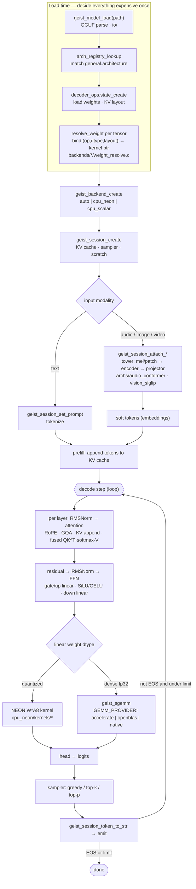

# geist Architecture

geist is a C23 inference runtime built around one idea: **decide everything
expensive at load time, so the hot path is branch-light.** This document maps
the codebase and the design rationale referenced from
[`include/geist.h`](../include/geist.h).

## Three layers

```
include/geist.h          public C ABI (the only supported surface)
  │
src/engine/              orchestration: model load, sessions, sampler,
  │                      tokenizers, allocators, backend/arch registries
src/archs/               architectures: how a model's forward pass is wired
  │   transformer/         Gemma 4 family (RoPE, GQA, KV cache, PLE, head)
  │   audio_conformer/     Conformer audio tower (mel → encoder → soft tokens)
  │   vision_siglip/       SigLIP vision tower (image/video → soft tokens)
src/backends/            compute: the kernels that actually run the ops
      common/              shared compute library (GEMM facade, gemma4 kernels, KIVI)
      cpu_neon/            Apple Silicon + ARM64, OpenMP-parallel
      cpu_scalar/          portable reference (correctness oracle)
      cpu_x86/             x86-64 AVX-512 / VNNI (opt-in; runtime hw_probe dispatch)
      metal/               Apple GPU (opt-in, experimental; dlopen'd Metal.framework)
      vulkan/              Linux/NVIDIA GPU (opt-in, experimental; dlopen'd libvulkan)
src/formats/             GGUF + PTQTP quant (de)quantization
src/io/                  GGUF reader, safetensors reader
src/base/                freestanding utilities: heap, error, hw_probe
```

An **architecture** knows the shape of the computation (which ops, in which
order, with which tensors). A **backend** knows how to execute an op on a given
dtype/layout. The engine binds the two and drives sessions. Backends and archs
are listed in compile-gated registries (`src/engine/*_registry.c`, each entry
behind a `GEIST_BACKEND_*` / `GEIST_ARCH_*` guard), so the set compiled in is a
build-time choice (`make BACKENDS="..."`) and the one used is a runtime choice
(`geist_backend_create("auto" | "cpu_neon" | ...)`).

### Dependency rules

The include graph follows the layers strictly — these rules are load-bearing,
not aspirational (the tree conforms today):

- `src/base/` includes nothing above it; everyone may include `src/base/`.
- `src/engine/` includes `base` and the public headers. It never reaches into
  an arch or backend implementation — with exactly **two composition points**:
  `arch_registry.c` and `backend_registry.c`, the only files that name concrete
  archs/backends (each entry compile-gated).
- `src/archs/` never includes a concrete backend (`cpu_*`, `metal`, `vulkan`).
  Ops reach
  compute through the backend vtbl. The one sanctioned shortcut is
  `src/backends/common/` — the shared compute library (GEMM facade, gemma4
  kernels, KIVI) that is always compiled and may be called directly from archs.
- `src/backends/<name>/` includes `base` and `backends/common` only; a backend
  never includes another backend or an arch.
- `src/formats/` and `src/io/` sit beside the backends: `base` only.

A new backend or arch therefore touches its own directory, one `mk/backend-*.mk`
fragment, and one registry entry — nothing else.

## Processing pipeline

End-to-end flow of a request, from loading a model to emitting tokens. Load-time
work (parse, kernel binding) happens once; the decode loop is the per-token hot
path. The dense-fp32 `geist_sgemm` node is where the build-time `GEMM_PROVIDER`
(accelerate / openblas / native) plugs in; quantized weights bypass it entirely
via the kernel bound at load time.


```mermaid
flowchart TD
    subgraph LOAD["Load time — decide everything expensive once"]
        A["geist_model_load(path)<br/>GGUF parse · io/"] --> B["arch_registry_lookup<br/>match general.architecture"]
        B --> C["decoder_ops.state_create<br/>load weights · KV layout"]
        C --> D["resolve_weight per tensor<br/>bind (op,dtype,layout) → kernel ptr<br/>backends/*/weight_resolve.c"]
    end

    D --> E["geist_backend_create<br/>auto | cpu_neon | cpu_scalar"]
    E --> F["geist_session_create<br/>KV cache · sampler · scratch"]

    F --> G{"input modality"}
    G -->|text| H["geist_session_set_prompt<br/>tokenize"]
    G -->|audio / image / video| I["geist_session_attach_*<br/>tower: mel/patch → encoder → projector<br/>archs/audio_conformer · vision_siglip"]
    I --> J["soft tokens (embeddings)"]
    H --> K["prefill: append tokens to KV cache"]
    J --> K

    K --> L{{"decode step (loop)"}}
    L --> M["per layer: RMSNorm → attention<br/>RoPE · GQA · KV append · fused QK^T·softmax·V"]
    M --> N["residual → RMSNorm → FFN<br/>gate/up linear · SiLU/GELU · down linear"]
    N --> O{"linear weight dtype"}
    O -->|quantized| P["NEON W*A8 kernel<br/>cpu_neon/kernels/*"]
    O -->|dense fp32| Q["geist_sgemm<br/>GEMM_PROVIDER: accelerate | openblas | native"]
    P --> R["head → logits"]
    Q --> R
    R --> S["sampler: greedy / top-k / top-p"]
    S --> T["geist_session_token_to_str → emit"]
    T -->|"not EOS and under limit"| L
    T -->|"EOS or limit"| U(["done"])
```

Speculative decode (`geist_session_decode_speculative`) replaces the single
`decode step` with an n-gram draft + one batched `verify_forward`; on a miss it
falls back to the sequential path shown above.

## Above the ABI: what the engine deliberately does not do

The tool-use agent, the resident `dynamic-tools-v1` daemon and the constrained
decoding that forces a well-formed call out of a model that cannot emit one
are **not** in this repository. They live in
[geisten/geistagent](https://github.com/geisten/geistagent), built on top of
the public API described here.

That split is the point rather than an accident of history. The agent layer is
where a whitelist decides whether a model may act; the engine is where tokens
are produced. Keeping the loop above the ABI means the constrained-decoding
capability is reconstructed from the public peek/prefill primitives instead of
buried in the sampler — `libgeist` stays small, and the code that gates actions
stays auditable in one place, outside the engine that has no opinion about
them.

What the engine owes that consumer is written down and enforced:
[API_CONTRACT.md](API_CONTRACT.md) lists the symbols an out-of-tree agent
runtime links across a release boundary, and `make agent-contract-smoke`
fails here — not in the consumer's build — if a signature moves.

## Zero-dispatch kernel binding

Generic engines walk a layer-dispatch loop every token, switching on dtype and
op. geist instead resolves, **at model-load time**, a direct function pointer
for each tensor's `(op, dtype, layout)` combination
(`src/backends/*/weight_resolve.c`, `kernel_catalog.c`). The decode loop then
calls bound kernels with no vtable walk or format switch. This matters most on
single-core-heavy edge CPUs where dispatch overhead is a real fraction of the
per-token budget.

Capabilities are queryable up front via `geist_backend_supports_op` returning
`NONE` / `EMULATED` / `NATIVE`, so an arch can pick the best available path or
fail cleanly rather than discovering an unsupported combination mid-forward.

## Tensors: dtype vs layout

A `geist_tensor` separates the **logical** dtype (`F32`, `Q4_K`, `TQ2_0`, …)
from the **physical** layout (`DENSE`, `BLOCK_QUANTIZED`, `TERNARY_BITPLANE`,
…). Block-quantized formats carry a `geist_quant_desc` with bits-per-value as an
exact rational (`158/100` for 1.58-bit), block size, and scale/zero offsets.
This is what lets ternary BitNet be a first-class citizen rather than a bolt-on:
the kernel for a `TERNARY` weight does only adds/subtracts, no multiplies.

## Op vocabulary

The backend op set (`enum geist_op`) is deliberately small: `LINEAR`,
`RMSNORM`, `RESIDUAL_ADD`, `SILU_GATE`, `EMBEDDING_LOOKUP`, `ATTENTION`,
`ROPE`, plus reserved SSM ops (`SSM_STEP`/`SSM_SCAN`/`CONV1D`) for a future
Mamba arch. Fused attention (QKᵀ → softmax → V) is one op so the backend can
keep the score matrix in registers/L1.

## Sessions and the KV cache

A `geist_model` is immutable, shared, read-only weights. A `geist_session` owns
the mutable per-conversation state: KV cache, pending logits, sampler config,
stats. Multiple sessions can share one model. The KV cache supports quantized
modes (`INT8`, packed `INT4` — half the INT8 footprint, near-lossless via a
default-on Hadamard rotation, `GEIST_KV_ROT=0` to opt out; and `KIVI` 2-bit)
and prefix pinning
(`geist_session_pin_prefix`) to
amortize a constant system prompt across chat turns. Speculative decode drafts
via an n-gram lookup over history and verifies in one batched forward.

The rotation and packed-INT4 modes store K post-RoPE and rotated; this is only
safe because geist never re-bases cached positions (the sliding window masks,
it does not re-RoPE the cache). A future KV context-shift feature would have to
un-rotate/unpack before re-RoPE-ing — see the note atop `forward/kv_store.c`.

## Multimodal: soft-token prefixes

Instead of a "Whisper → text → LLM" cascade, the audio/vision towers produce
embedding **soft tokens** that are prefixed directly into the LM's KV cache
(`attach_audio` / `attach_image` / `attach_video`). The LM attends to the
modality embeddings directly, cutting latency and preserving information that a
text bottleneck would discard.

## Where to start reading

- The forward pass: `src/archs/transformer/forward/step.c`.
- Kernel binding: `src/backends/cpu_neon/weight_resolve.c`.
- A representative low-bit kernel: `src/backends/cpu_neon/kernels/q4_K.c`.
- The public contract: `include/geist.h` (stability tags per symbol), and
  what those tags promise across a release boundary:
  [API_CONTRACT.md](API_CONTRACT.md).
- The tool-use runtime (`agent.h`, `--serve`, dynamic-tools-v1):
  [geisten/geistagent](https://github.com/geisten/geistagent).
- Building self-contained binaries and deploying: [DEPLOY.md](DEPLOY.md).

Per directory, the file to open first:

| Directory | Start here | It owns |
| :-- | :-- | :-- |
| `src/base/` | `heap.h` | arenas/allocators, error codes, hw probe |
| `src/engine/` | `session.c` | load → session → decode loop, tokenizers, registries |
| `src/archs/transformer/` | `forward/step.c` | the per-token forward pass |
| `src/archs/audio_conformer/` | `audio_encoder.c` | mel → Conformer → soft tokens |
| `src/archs/vision_siglip/` | `vision_encoder.c` | image/video → SigLIP → soft tokens |
| `src/backends/common/` | `geist_gemm.c` | shared GEMM facade + gemma4 kernels |
| `src/backends/cpu_neon/` | `weight_resolve.c` | load-time kernel binding, NEON kernels |
| `src/backends/cpu_x86/` | `backend.c` | AVX-512/VNNI kernels, runtime dispatch |
| `src/backends/cpu_scalar/` | `backend.c` | the portable correctness oracle |
| `src/backends/metal/` | `backend.c` | Apple-GPU path (shaders in `metal_shaders.h`) |
| `src/backends/vulkan/` | `backend.c` | Linux/NVIDIA-GPU path (SPIR-V in `shaders/`) |
| `src/formats/gguf/` | `common.c` | per-quant decode (one file per format) |
| `src/io/` | `gguf_reader.c` | GGUF/safetensors file parsing |
| `tools/` | `geist.c` | the demo CLI and the header-only SDK |
