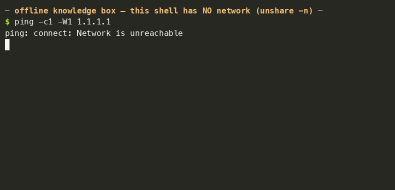
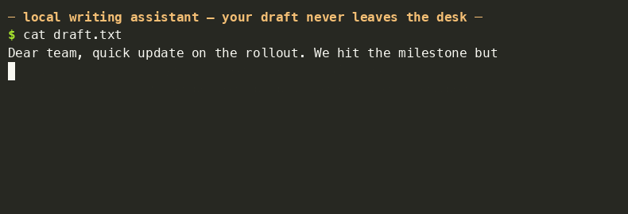

# Demos — measured, on the reference board

Everything on this page was recorded on the 4 GB Raspberry Pi 5 the
[benchmarks](../benchmark/README.md) run on, against the shipped
BitNet binary (release asset `geist-bitnet-linux-arm64`) from the
[release page](https://github.com/geisten/geistlib/releases/latest); the
recordings show the un-renamed asset name.
Nothing is sped up; the recordings play at wall-clock speed.

## geist vs bitnet.cpp — same Pi, same GGUF

<p align="center">
  
</p>

Recorded **sequentially** on the same board and shown side by side — running
both at once would split the 4 cores and slow both. Fairness controls, all
visible in the frame:

- byte-identical GGUF (`ggml-model-i2_s.gguf`, the canonical Microsoft file);
- both greedy (`--temp 0`), 4 threads, same 9-token prompt, 110 new tokens;
- each take starts from a thermally gated board (≤ ~57 °C, official active
  cooler) with the temperature printed before and after;
- engine versions in the banner: geistlib v0.8.2 vs microsoft/BitNet
  `404980e`, each engine's own pages pre-warmed so neither pays the other's
  SD-card reload.

Result in this recording: **15.5 tok/s end-to-end vs 9.31 tok/s eval**
(bitnet.cpp's own timing line). The frozen 10-repeat protocol says the same
thing with error bars: [benchmark/README.md](../benchmark/README.md).

> Why `404980e` (June 2025) and not today's BitNet `main`? Current `main`
> (`0b341e5`) mis-decodes the canonical i2_s GGUF on ARM — it emits `????…`
> where text should be. Speed-only harnesses (`llama-bench`) don't notice;
> a video does. The June state generates correct text, token-identical to
> geist's output for the first dozens of tokens (both greedy).

## Offline knowledge box

<p align="center">
  
</p>

The whole shell runs under `unshare -n` — a network namespace with **no
network at all**, proven by the failing `ping` in the frame. The answers
(baking soda vs baking powder, boiling point at altitude) come entirely from
the 1.2 GB on the SD card. A small model is a *knowledge sketchpad*, not an
oracle: see [model limits](PI5_BITNET.md#model-limits-and-responsible-use)
before trusting it with anything that matters.

## Local writing assistant

<p align="center">
  
</p>

The batch mode (`-` reads prompts from stdin) turns the CLI into a pipe
stage: drafts go in, continuations come out, and nothing ever leaves the
machine. Phrase the input as text-to-continue (geist applies no chat
template); the REPL (run with no arguments) does the same interactively.

## Embedded appliance — your product, one file

The same engine embeds in your own binary; the model can be folded in too,
so the deployment is literally one file (that is exactly how `geist-bitnet`
itself is built — see
[release.yml](../.github/workflows/release.yml)):

```c
extern const unsigned char geist_model_start[], geist_model_end[];

struct geist_backend *be;  struct geist_model *m;  struct geist_session *s;
geist_backend_create("auto", nullptr, nullptr, &be);
geist_model_load_from_memory(geist_model_start,
                             geist_model_end - geist_model_start, be, &m);
geist_session_create(m, be, &(struct geist_session_opts){0}, &s);
/* prefill + decode_step loop — ~15 lines total, see examples/ */
```

Weights alias zero-copy from the binary's read-only data (demand-paged, RAM
cost equals the mmap path). Full recipe: [DEPLOY.md](DEPLOY.md); API
walkthrough: [QUICKSTART.md](QUICKSTART.md).
