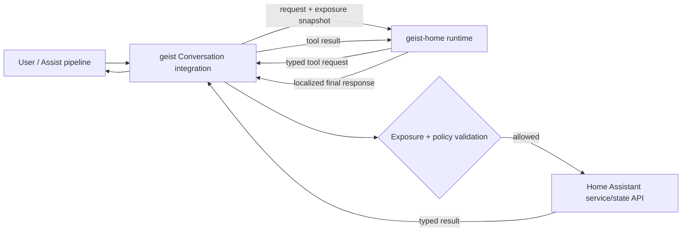

# Home Assistant Phase 2: native local appliance

Status: proposed for implementation after the Phase 1 soak and release gate.

Phase 2 turns the developer preview into an installable Home Assistant beta.
The product remains deliberately narrow: a private, CPU-only conversation agent
that controls only entities exposed to Assist. It does not introduce a public
inference server or make Home Assistant depend on a cloud service.

## Outcomes and non-goals

Phase 2 is complete when a Home Assistant user can install Geist through the UI,
select a language, see whether the model is healthy, and update or roll back the
runtime without using SSH. The beta must support Home Assistant OS on `aarch64`
and `amd64`, while preserving the same-host Unix-socket path for Home Assistant
Core and Container users.

The following are not Phase 2 goals:

- a general OpenAI-compatible HTTP API;
- remote access to the model outside the Home Assistant installation;
- arbitrary Home Assistant service calls generated by the model;
- locks, alarm panels, garage doors, or other high-impact domains by default;
- submission to Home Assistant Core before the external beta is stable.

## Architecture decision

Home Assistant owns authorization and execution. Geist owns local inference,
deterministic target resolution, and planning. The current preview gives the
daemon a long-lived Home Assistant token and lets its tools call the HA REST API.
Phase 2 removes that token.

The integration rejects a tool request unless its entity is still exposed, its
domain and action are in the compiled policy, and its arguments satisfy the
schema. The runtime keeps the same checks as defense in depth. A registry update
or entity unexposure takes effect before the next tool execution, not merely
after the next model request.

### Deployment profiles

| Profile | Runtime packaging | Transport | Home Assistant credentials |
| :-- | :-- | :-- | :-- |
| HA OS / Supervised | Geist Home Assistant app (formerly add-on), model embedded in the image | private internal TCP, no host port | none in the runtime; integration executes actions |
| Core / Container on Linux | released `geist-home` binary + systemd | Unix socket mode `0600` | none in the runtime; integration executes actions |
| Existing Phase 1 install | current binary and v1 line protocol | Unix socket | supported for one migration release, with a deprecation warning |

The app runs protected, without host networking, Docker access, privileged
capabilities, or a mount of Home Assistant's configuration directory. Persistent
runtime data belongs in the app's `/data` volume. An AppArmor profile permits
only the files and network endpoints needed by the runtime. The app image is
published for `aarch64` and `amd64`, signed, checksummed, and pinned to an exact
Geist/model version.

The private TCP listener is an app transport, not a general inference API. It is
reachable only on Home Assistant's internal app network and uses the same
versioned protocol as the Unix socket. Core/Container installations do not open
a TCP listener.

## Protocol v2

Protocol v2 is a length-prefixed UTF-8 JSON stream over either Unix socket or
private TCP. Every frame contains `version`, `request_id`, and `type`. Frames
have an explicit maximum size and requests have deadlines.

Required frame types:

- `hello`: negotiate protocol version and runtime capabilities;
- `health`: runtime/model version, readiness, model load state, uptime, memory,
  last request latency, and last error without secrets or utterance text;
- `registry.replace`: versioned snapshot of Assist-exposed entities, areas,
  aliases, supported actions, and locale;
- `conversation.start`: utterance, locale, registry version, and request budget;
- `tool.call`: one typed state read or bounded action request;
- `tool.result`: success, typed state, or a stable error code;
- `conversation.result`: localized speech text and optional non-sensitive trace
  summary;
- `cancel`: stop work when Home Assistant abandons or times out a request.

The first implementation supports a single in-flight conversation per model
instance and returns `busy` for excess work. Unknown versions, frame types,
oversized frames, stale registry versions, and invalid tool arguments fail
closed. Raw tokens, access tokens, complete state dumps, and conversation text
must never appear in diagnostics.

Protocol v1 remains available only on Unix sockets during the migration release.
The integration tries v2 first and may fall back to v1 only when the user has
explicitly enabled compatibility mode.

## Home Assistant integration

The custom integration becomes UI-first and targets the Home Assistant Bronze
quality baseline before the external beta:

- config flow tests connectivity before creating an entry;
- the add-on discovery (`hassio`) path pre-fills the internal endpoint;
- reconfigure flow changes transport, endpoint, language, and timeout;
- German and English translations cover setup, errors, repairs, and entities;
- a diagnostic sensor/device exposes readiness, runtime/model version, latency,
  and registry age;
- Repairs report an unreachable runtime, incompatible protocol, missing model,
  stale registry, or unsupported architecture;
- downloadable diagnostics redact utterances, aliases, entity state values,
  paths, addresses, and credentials;
- unload/reload and runtime reconnection do not require a Home Assistant restart.

The selected Home Assistant language is the default response locale. An explicit
integration option can override it. This replaces `GEIST_HOME_LANG` for normal
users; the environment variable remains a CLI/testing override.

HACS is the beta distribution mechanism for the custom integration. The
repository must pass HACS validation and Hassfest, publish tagged releases, and
place the component in a HACS-compatible release artifact. The Geist app has its
own Home Assistant app repository and signed container images. They share a
version compatibility table but can be upgraded independently within a declared
protocol range.

## Delivery plan

### P2.0 — contracts and migration

1. Freeze the Phase 1 evidence and publish the first `geist-home` release.
2. Add protocol-v2 schemas, stable error codes, limits, and golden transcripts.
3. Split planning from HA execution behind an executor interface.
4. Retain a v1 adapter and document the one-release migration window.

Exit gate: model-free contract tests prove malformed, stale, oversized, unknown,
and unexposed requests fail closed; current German/English evaluation results do
not regress.

### P2.1 — HA-owned execution

1. Implement the v2 conversation/tool loop in the integration and daemon.
2. Validate every requested entity, domain, action, and argument immediately
   before calling Home Assistant.
3. Move state reads, service calls, and relative climate read-modify-write into
   the integration.
4. Remove the HA URL/token requirement from the normal daemon path.

Exit gate: the disposable real-HA suite passes with no HA credential available
to the runtime, including unexpose-during-request and malicious-frame cases.

### P2.2 — UI and operability

1. Add discovery, connection-tested config and reconfigure flows.
2. Add DE/EN translations, HA-language defaulting, diagnostics, health entities,
   and Repairs.
3. Add reconnect, cancellation, busy handling, bounded queues, and structured
   secret-free logging.

Exit gate: a non-developer can install and diagnose an intentionally broken
runtime without editing YAML or reading daemon logs.

### P2.3 — Home Assistant app and distribution

1. Create the app repository metadata, protected runtime image, AppArmor policy,
   health check, persistent model storage, and multi-architecture build.
2. Publish signed `aarch64` and `amd64` images plus an SBOM and checksums.
3. Add HACS and Hassfest validation for the integration release artifact.
4. Test upgrades, downgrade compatibility, backup/restore, and rollback.

Exit gate: a fresh HA OS installation reaches the first correct request in ten
minutes without SSH, shell commands, YAML editing, or a manually created token.

### P2.4 — beta breadth and evidence

1. Extend the published corpus to `cover`, `fan`, `media_player`, and read-only
   sensors; keep high-impact actions disabled by default.
2. Add paraphrases for at least four additional languages, while keeping all
   deterministic user-facing integration text translated through HA.
3. Run 24-hour upgrade/rollback soaks and collect opt-in, redacted beta reports
   from at least five installations across both architectures.
4. Publish the installation video, compatibility matrix, known limitations, and
   reproducible Pi 5 measurements.

Exit gate: at least five external installations, zero exposure-boundary
violations, no unbounded memory growth, and the existing latency/accuracy budgets
remain green.

## Workstreams and ownership boundaries

| Workstream | Main artifacts | Must not own |
| :-- | :-- | :-- |
| Runtime | protocol codec, planner/executor boundary, model health, cancellation | HA credentials or exposure policy |
| HA integration | config flow, exposure snapshot, policy executor, diagnostics, translations | model files or process lifecycle |
| HA app | runtime image, model persistence, healthcheck, update/rollback | arbitrary HA config mounts or public ports |
| Release engineering | signed images, SBOM, HACS/Hassfest checks, compatibility matrix | behavior changes without contract tests |
| Evaluation | multilingual corpus, security cases, fresh-host and soak reports | private home state or raw user utterance collection |

## Acceptance scorecard

| Area | Phase 2 target |
| :-- | :-- |
| Installation | first correct request in <= 10 minutes on fresh HA OS, no shell/YAML/token |
| Authorization | 0 calls for unexposed entities, including race and stale-registry tests |
| Security | protected app; no HA token in runtime; no host port; signed images and SBOM |
| Reliability | reconnect after app/Core restart; 24 h soak; bounded RSS and queue |
| UX | UI setup/reconfigure, DE/EN translations, health device, Repairs and redacted diagnostics |
| Compatibility | HA OS `aarch64`/`amd64`; Core/Container Unix-socket path retained |
| Quality | HACS + Hassfest green; model-free protocol/policy tests in every CI run |
| Beta | >= 5 external installations and published anonymized results |

## Risks and explicit trade-offs

- **Two packages:** HA OS users install an app and an integration until Geist can
  qualify for Home Assistant Core. Discovery and a single guided document reduce,
  but do not eliminate, this friction.
- **Protocol complexity:** an iterative tool protocol is more work than giving the
  daemon a token. It is justified because HA can enforce authorization at the
  final action boundary and the runtime becomes safe to distribute as an app.
- **Large images:** embedding the model makes the first download large. Use one
  immutable image per supported model initially; defer an in-app model catalog
  until update, storage, and checksum behavior are proven.
- **Language breadth:** model understanding and deterministic UI translation are
  separate. Phase 2 expands evaluation languages without claiming equal quality
  until each published suite passes.
- **Core/Container differences:** Unix socket remains the secure default there;
  internal TCP exists solely because HA Core and an app run in separate
  containers on HA OS.

## First implementation slice

The first code PR after this document should contain only the v2 frame codec,
schema validation, golden transcripts, and an executor interface with a fake HA
backend. It must not yet package an app or change the production transport. This
keeps the security contract reviewable before process and distribution changes
depend on it.

## Design references

- [Home Assistant app architecture and lifecycle](https://developers.home-assistant.io/docs/add-ons/)
- [App configuration and multi-architecture images](https://developers.home-assistant.io/docs/apps/configuration/)
- [App communication and internal networking](https://developers.home-assistant.io/docs/apps/communication/)
- [App security and protected mode](https://developers.home-assistant.io/docs/apps/security/)
- [Config flows, discovery, reconfigure, and migration](https://developers.home-assistant.io/docs/core/integration/config_flow/)
- [Home Assistant Integration Quality Scale](https://developers.home-assistant.io/docs/core/integration-quality-scale/)
- [HACS publication requirements](https://hacs.xyz/docs/publish/include/)
